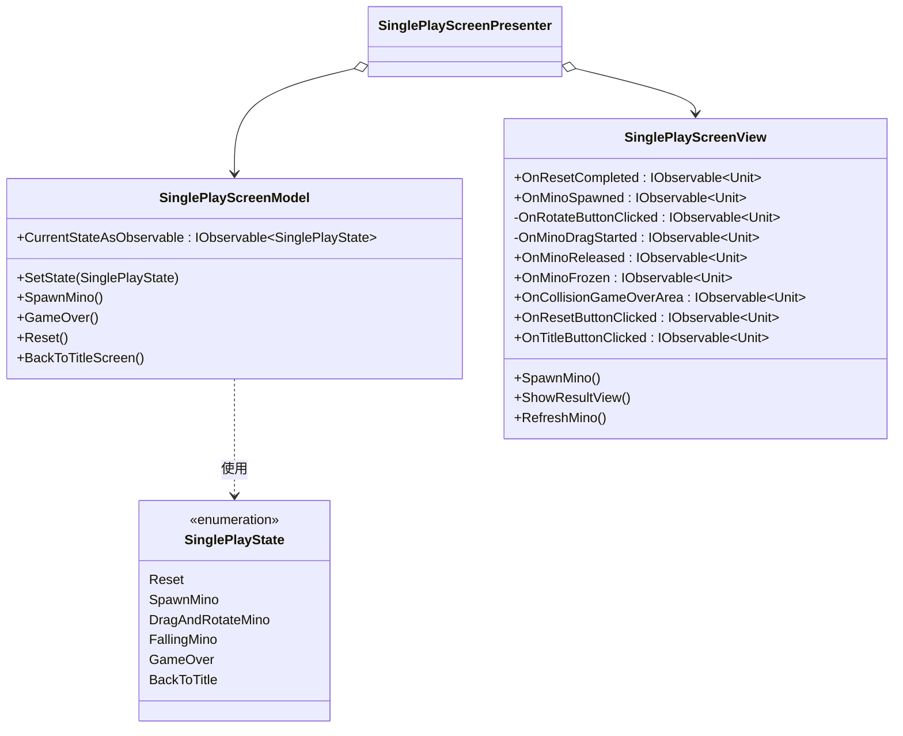

```mermaid
classDiagram
    class SinglePlayState {
        Reset
        SpawnMino
        DragAndRotateMino
        FallingMino
        GameOver
        BackToTitle
    }
    <<enumeration>>SinglePlayState

    class SinglePlayScreenModel {
        +CurrentStateAsObservable : IObservable~SinglePlayState~
        +SetState(SinglePlayState)
        +SpawnMino()
        +GameOver()
        +Reset()
        +BackToTitleScreen()
    }

    class SinglePlayScreenPresenter {

    }

    class SinglePlayScreenView {
        +OnResetCompleted : IObservable~Unit~
        +OnMinoSpawned : IObservable~Unit~
        -OnRotateButtonClicked : IObservable~Unit~
        -OnMinoDragStarted : IObservable~Unit~
        +OnMinoReleased : IObservable~Unit~
        +OnMinoFrozen : IObservable~Unit~
        +OnCollisionGameOverArea : IObservable~Unit~
        +OnResetButtonClicked : IObservable~Unit~
        +OnTitleButtonClicked : IObservable~Unit~

        +SpawnMino()
        +ShowResultView()
        +RefreshMino()
    }

    SinglePlayScreenPresenter o--> SinglePlayScreenModel
    SinglePlayScreenPresenter o--> SinglePlayScreenView
    
    SinglePlayScreenModel ..> SinglePlayState : 使用
```