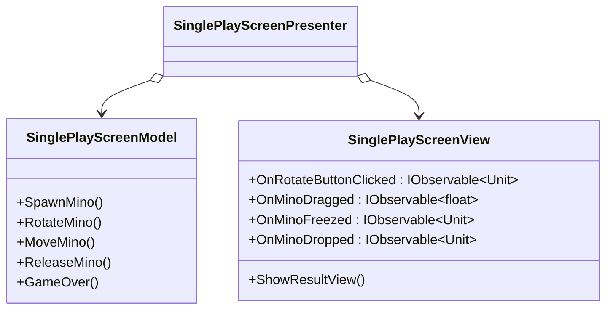

```mermaid
classDiagram
    class SinglePlayScreenModel {
        +SpawnMino()
        +RotateMino()
        +MoveMino()
        +ReleaseMino()
        +GameOver()
    }

    class SinglePlayScreenPresenter {

    }

    class SinglePlayScreenView {
        +OnRotateButtonClicked : IObservable~Unit~
        +OnMinoDragged : IObservable~float~
        +OnMinoFreezed : IObservable~Unit~
        +OnMinoDropped : IObservable~Unit~

        +ShowResultView()
    }

    SinglePlayScreenPresenter o--> SinglePlayScreenModel
    SinglePlayScreenPresenter o--> SinglePlayScreenView
```