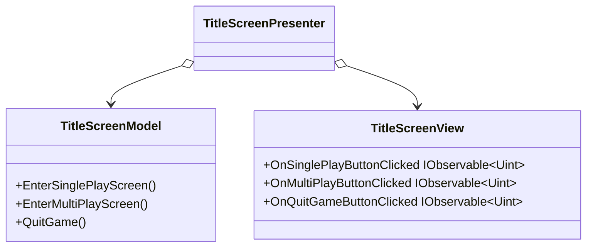

```mermaid
classDiagram
    class TitleScreenModel {
        +EnterSinglePlayScreen()
        +EnterMultiPlayScreen()
        +QuitGame()
    }

    class TitleScreenPresenter {

    }

    class TitleScreenView {
        +OnSinglePlayButtonClicked IObservable~Uint~
        +OnMultiPlayButtonClicked IObservable~Uint~
        +OnQuitGameButtonClicked IObservable~Uint~
    }

    TitleScreenPresenter o--> TitleScreenModel
    TitleScreenPresenter o--> TitleScreenView
```